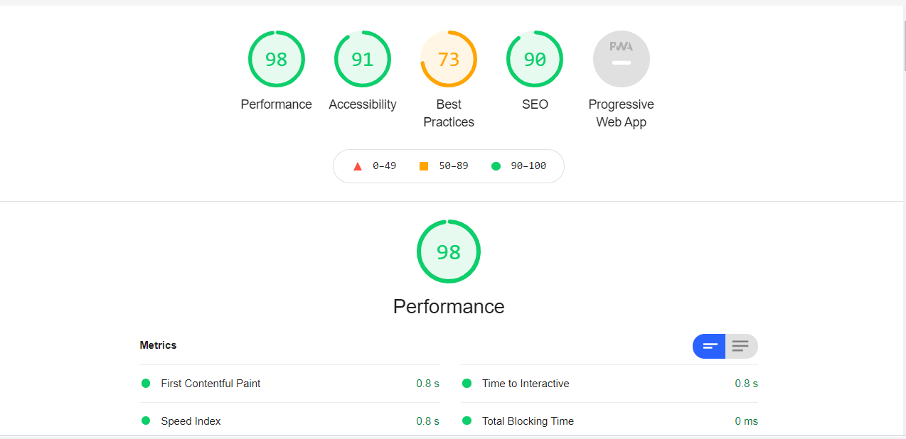
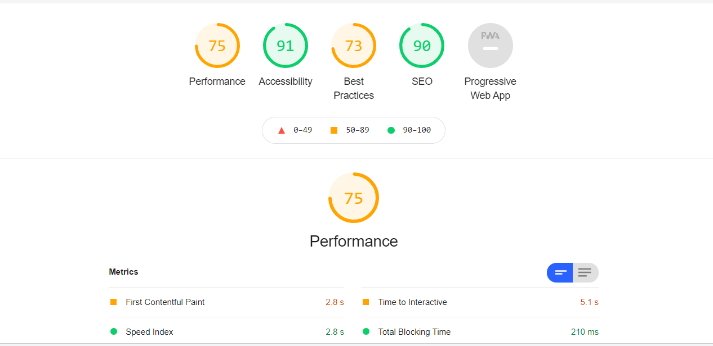
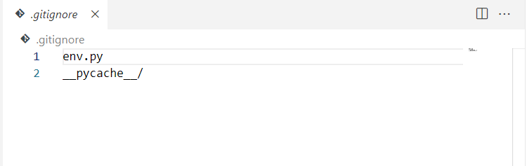
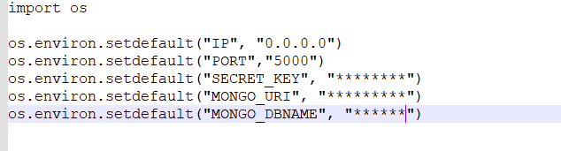
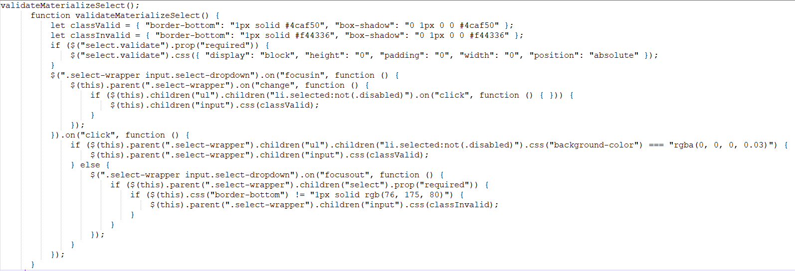

# **The-Cook-Book**
## Milestone_Project-3_Code-Institute
____
# **About**
### 
The Cook Book is the book of recipes where in users can register, login and store their authentic, traditional and simple recipes into the App.
Users can also look into other user's recipes. 
Users will be allowed to add recipes, edit recipes and delete recipes of which they have created.
This website will be helpful for the people who love to cook and share the secrets of tasty recipes to friends and family members.
____

:point_right:
[Live Demo](https://flask-cook-book-ms3.herokuapp.com/)
# **Contents**

* [UX](#ux)
* [Strategy](#strategy)
* [Scope](#scope)
* [Structure](#structure)
* [Skeleton](#skeleton)
    * [Wireframes](#wireframes)
* [Surface](#surface)
* [Technologies](#technologies-used) 
* [Features](#feautures) 
* [Testing](#testing)
* [Deployment](#deployment)
* [Credits](#credits)
* [Acknowledgements](#acknowledgements)

## UX

## **Skeleton**

## **Surface**
### Color palette
___

___

* **Timeless Nautical** color palette has been used for this website.

* #00293C **Navy** - used for Navbar and Footer.

* #F1F3CE **Ivory** - used for the Background color of the  body.

* #1E656D **Peacock Blue** - used for Buttons: Show more, Search, Add Recipe, Edit Recipe, Add Category, Edit Category.

* #F62A00 **Candy Apple** - used for the Flash Messages, Reset button, Delete buttons and Hover.

# **Technologies Used**

* [Python3](https://www.python.org/)
    * [Flask](https://flask.palletsprojects.com/en/1.1.x/tutorial/layout/) - Python framework was used all project. Flask depends on the Jinja template engine and the Werkzeug WSGI toolkit.
    * [PyMongo](https://pymongo.readthedocs.io/en/stable/) - is a Python distribution containing tools, used for working with MongoDB.
    * [Werkzeug](https://werkzeug.palletsprojects.com/en/1.0.x/utils/#module-werkzeug.security) - used for password security.
    * [Jinja](https://jinja.palletsprojects.com/en/3.0.x/) - used in conjuction with python for the working of the website
* [MongoDB](https://www.mongodb.com/) - database was used to storing and retrieving information in the website.
* **HTML** - used for creating the website.
* **CSS** - used for styling the website.
* [jQuery](https://jquery.com/) - used for confirmation messages and interactive design, also initialise MaterializeCSS components.
* [MaterializeCSS](https://materializecss.com/)- used to create responsive design, grid system, buttons, navbar, sidenav, dropdown, footer, modal, cards, forms.
* [balsamiq](https://balsamiq.com/wireframes/) - used to create wireframes.
* [Gitpod](https://www.gitpod.io/) - used to built all project.
* [GitHub](https://github.com/) - used to hosting the website.
* [Heroku](https://id.heroku.com/) - used to deploy the website.
* [W3C Markup Validation Service](https://validator.w3.org/) - used to validate HTML code.
* [CSS Validation Service](https://jigsaw.w3.org/css-validator/) - used to validate css code.
* [JSHint](https://jshint.com/) - used to validate the jQuery code.
* [PEP8 online](http://pep8online.com/) - used to validate the Python code.

# **Testing**
___

 * ### **Code Validity**
    Code validity was performed by the following tools and passed except warnings due to HTML validator was unable to recognize Jinja templates.

    * HTML Markup Validation [Pass](https://validator.w3.org/)
    * CSS Validation [Pass](https://jigsaw.w3.org/css-validator/)
    * JSHint [Pass](https://jshint.com/)
    * PEP8 [Pass](http://pep8online.com/)

* ### **Testing user stories**
* ### **Functionality testing**
* ### **Defensive design testing**
* ### **Responsiveness**
    The responsiveness of the website was tested physically on Laptops, Desktops, Big screen, Mobile, Tablets and also using Am I Responsive tool as well as Google Dev Tools Device Mode.
    All tests have shown that site is fully responsive and fits and adapts well to the different viewport size devices.
* ### **Performance testing**
    Performance testing was carried out using Lighthouse in Chrome Developer Tools.
    * Desktop Performance was excellent in accessibility.
    
    * Mobile - Performance was in average accessibility
    

# **Deployment**
___

* This website is developed by using Gitpod workspace  and GitHub repository to commit and push changes. This project uses GitHub for hosting and has been deployed using Heroku. 

* Following steps can be used to access the page :-

### **Download**
* Git hub navigate to https://github.com/Bhargavi84/The-Cook-Book
* Click the **Code** button.
* Click the **Download Zip**.
* Extract 

### **Clone Repository**

* GitHub navigate to https://github.com/Bhargavi84/The-Cook-Book
* Click the Code button.
* To clone with HTTPS copy the URL in the box https://github.com/Bhargavi84/The-Cook-Book.git
* Open your Git Bash.
* Changed the directory to the location where you want to clone.
* Type git clone than paste the copied URL git clone https://github.com/Bhargavi84/The-Cook-Book.git
Press Enter , your local clone will be created.

### **Creating env file**

Install Flask, in the terminal type pip3 install Flask , this will install Flask functionality. Create env.py file for storing sensitive data, type touch env.py in terminal. This file should never be pushed to GitHub, so type touch .gitignore to ignore it. Than open the .gitignore file and ignore your env.py file type:

save and close it.

In the env.py file we need to hide several bits of data. Open env.py file and type:

## **Fork the project**

* To create a personal copy of this repository, click on Fork button on the top right corner of the repository page in GitHub.

### **Database Access**

# **Credits**
### Contents
_____

* Family and Friends for uploading their own recipes.

### Code
____

* Inspiration by Task Manager Mini Project from Code Institute.
* The below script was borrowed from code institute mini project.

### Design
___

* Andrius-siup Recipe book
* Nazulka for WDBuzzwords for website testing 

## References
___

* MaterializeCSS 
* W3Schools 
* Flask docs 
* PyMongo docs 
* MongoDB docs
* Werkzeug docs 
* Code Institute course material.
* Canva website for color palette.
* StackOverflow
* https://codepen.io/

## Media

___

* https://imgur.com/upload - imgur platform has been used for uploading the images and copying the link and pasting in the url column in this project.

## Acknowledgements
___

* My mentor Excellence Ilesanmi for his continuous guidance and support throughout the project.
* Code Institute's Student care Team,Tutors and Slack Community for help and support.

## Disclaimer
___

* This project is purely educational purpose only.
