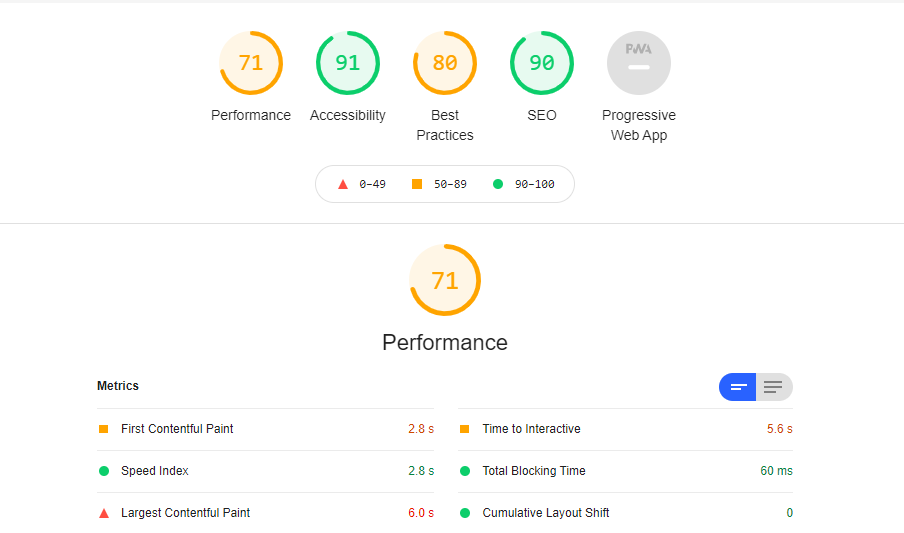

# **The-Cook-Book**
## Milestone_Project-3_Code-Institute

____
# **About**
### 
The Cook Book is the book of recipes where in users can register, login and store their authentic, traditional and simple recipes into the App.
Users can also look into other user's recipes. 
Users will be allowed to add recipes, edit recipes and delete recipes of which they have created.
This website will be helpful for the people who love to cook and share the secrets of tasty recipes to friends and family members.
____

:point_right:
[Live Demo](https://flask-cook-book-ms3.herokuapp.com/)
# **Contents**

* [UX](#ux)
* [Strategy](#strategy)
* [Scope](#scope)
* [Structure](#structure)
* [Skeleton](#skeleton)
    * [Wireframes](#wireframes)
    * [Database Diagram](#database-diagram)
* [Surface](#surface)
* [Technologies](#technologies-used) 
* [Features](#feautures) 
* [Testing](#testing)
* [Deployment](#deployment)
* [Credits](#credits)
* [Acknowledgements](#acknowledgements)

## UX
### **User Stories:**

## **Strategy**
**Objectives:**
* To provide a quick and fast feeling while accessing the website to all first time users.
* To create an easy way for storing the recipes and sharing to friends and family members.
* To make easy steps to see other users recipes which is already added.
* To know about the different food categories and ingredients.
* To ensure users are able to edit and delete recipes if they have entered wrongly.
* To make sure users can easily use search function and search their favourite dish in it. 

## **Scope**
* To create a website that will help the users get motivated to share their authentic and traditional recipes.
The website has been divided into different section so that users can easily look into that and the infomation are easy and understandable way so that  they can add, read, edit and delete their choices easily.

## **Structure**
* This  website is a food recipes storage website that contains three sections.
    * ### Non Registered users
    * ### Registered user
    * ### Admin

* Non Registered users or first time visitors:- can enter the webpage and see all 
recipes in Home page in order to see more they are supposed to register.
They can see only 3 option in Nav bar **Home , Login and Register** on top in desktop and in sidenav bar / hamburger menu in mobile phones and tabs.

* Registered user:- Once registered, users can click on login and enter the webpage. They can see **Home, Profile, New recipe, Logout**.Users can also look into their profile page and look other user's recipe by clicking on show more button in card in home page. 

* Admin :- Admin will have access to manage and delete categories and add and delete recipes (of other user's)
The idea behind this is any unknown users cannot upload any kind of irrelavant images or contents. 
Admin page will have **Home, Profile, New recipe, Manage Categories and Logout** options on Navbar.

## **Skeleton**
### Wireframes
   *  [Non Registered and Registered User's Wireframe](static/images/wireframes/non-registered-and-registered-user's-wireframe.png)

   * [Admin's Wireframe](static/images/wireframes/admin-wireframe.png)
### Database-Diagram
* The diagram below shows the relationship between fields of the existing database collections.

## **Surface**
### Color palette
___

___

* **Timeless Nautical** color palette has been used for this website.

* #00293C **Navy** - used for Navbar and Footer.

* #F1F3CE **Ivory** - used for the Background color of the  body.

* #1E656D **Peacock Blue** - used for Buttons: Show more, Search, Add Recipe, Edit Recipe, Add Category, Edit Category.

* #F62A00 **Candy Apple** - used for the Flash Messages, Reset button, Delete buttons and Hover.

# **Technologies Used**

* [Python3](https://www.python.org/)
    * [Flask](https://flask.palletsprojects.com/en/1.1.x/tutorial/layout/) - Python framework was used all project. Flask depends on the Jinja template engine and the Werkzeug WSGI toolkit.
    * [PyMongo](https://pymongo.readthedocs.io/en/stable/) - is a Python distribution containing tools, used for working with MongoDB.
    * [Werkzeug](https://werkzeug.palletsprojects.com/en/1.0.x/utils/#module-werkzeug.security) - used for password security.
    * [Jinja](https://jinja.palletsprojects.com/en/3.0.x/) - used in conjuction with python for the working of the website
* [MongoDB](https://www.mongodb.com/) - database was used to storing and retrieving information in the website.
* **HTML** - used for creating the website.
* **CSS** - used for styling the website.
* [jQuery](https://jquery.com/) - used for confirmation messages and interactive design, also initialise MaterializeCSS components.
* [MaterializeCSS](https://materializecss.com/)- used to create responsive design, grid system, buttons, navbar, sidenav, dropdown, footer, modal, cards, forms.
* [balsamiq](https://balsamiq.com/wireframes/) - used to create wireframes.
* [Gitpod](https://www.gitpod.io/) - used to built all project.
* [GitHub](https://github.com/) - used to hosting the website.
* [Heroku](https://id.heroku.com/) - used to deploy the website.

# **Features**
  ###  Existing Features
 ___
 * ### Navigation bar
 The nav bar feature is fixed in desktops and if resized turns into a hamburger icon in mobile and tablet screen and coresponding link will display from right side.
 * ### Home 
 The Home page feature have the search panel in which, it has two buttons Reset and Search.
 If user enters a word , it displays the results below the panel it takes data from from recipe name, category_name and Ingredients list. otherwise it displays a message 'No Results Found'
 Reset button resets the value entered in search button and retrieve the home page.

 * ### Profile
 The Profile page feature have the display of username on top of the page, also displays  user's recipes and has a show more button and when clicked it will take to show recipe page.

* ### New Recipe
The New recipe page feature, will take the new input in the form,  user can insert by choosing the category name and insert the recipe according to that.All entered data will be stored in MongoDB and redirected to the website's other pages. The form has a placeholder with an icon that will move up when the user clicks into the field. If the user leaves the input field empty and clicks Submit button, will display an error message(manadatory fields). The input line will also change the color to red.

* Choose your category :- field has a list of categories that the user can pick up for their recipe.
* Recipe Name :-field a user can input 5-30 characters long.
* Ingredients :- field a user can input 5- 5000 characters long and can be separated on a new line for final display all text into an array.
* Instructions:- field a user can input 5- 5000 characters long text and can be separated on a new line for final display all text into an array.
* IMG URL :- field the user has to paste image address and has to be 5-300 characters long.
* Preparation:- Time field a user can input numbers from 0-500.
* Cooking Time:- field a user can input numbers from 0-120.
* Serving:- field a user can input numbers from 1-100.
* Add recipe:- button has a color change when the user is hovers on the button, and when clicked will display flash message "Recipe successfully Added" routed to the profile page

* ### Edit Recipe
The Edit recipe has features to edit recipe form same as Edit recipe. Only recipe owners and website admin can edit recipes. There is a CANCEL button that will bring you back to a profile page, and the button save recipe will update the recipe and when clicked will display flash message "Recipe successfully updated" routed to the profile page. All edited data will be stored in MongoDB and redirected to others pages. The form has a placeholder with an icon that will move up when the user clicks into the field. If the user leaves the input field empty and clicked submit button will display an error message, also the input line change colors.

* Choose your category :- field has a list of categories that the user can pick up for their recipe.
* Recipe Name :-in this field a user can input 5-30 characters long.
* Ingredients :- in this field a user can input 5- 5000 characters long and can be separated on a new line for final display all text into an array.
* Instructions:- in this field a user can input 5- 5000 characters long text and can be separated on a new line for final display all text into an array.
* IMG URL :- in this field the user has to paste image address and has to be 5-300 characters long.
* Preparation Time :- in this field a user can input numbers from 0-500.
* Cooking Time:- in this field a user can input numbers from 0-120.
* Serving:- field a user can input numbers from 1-100.
* Save Recipe button has color change when the user hovers on the button, redirected user to show recipe page with new changes that user has made.
* CANCEL button redirected back to the show recipe page.

* ### Delete Recipe
The delete button is next to edit button in show recipe page.
when user clicks on this button the message is popped out for confirmation of deletion of the recipe and the pop up window has two options Ok and Cancel when user clicks Ok the recipe will be deleted and flash message is "Recipe successfully deleted" when user clicks cancel it routes back to show recipe page.Only recipe owners and website admin can delete recipes.

* ### Login page
The Login page feature will help the user to login to the website and if the user enters wrong username / password the flash message will pop out to alert to user to enter the correct credentials. The username field has to be a 5-15 character long string, Error message is displayed to enter manadatory fields(if nothing is entered). Clicking the login button the user will be routed to the user's profile page.There is a link to the Register page, below the login form. Clicking that link the user will be routed to the Register page.

* ### Register page
The register page  feature will help first time user to register to the page and create a login. username field is a string which has to be 5-15 characters long, including lower and upper case and any number(alphanemeric)
Error message is displayed to enter manadatory fields(if nothing is entered).
if the user enters wrong username / password the flash message will pop out to alert to user to enter the correct credentials. Clicking the register button the user will be routed to the user's profile page and flash message diplays "Registration successfull"

* ### Manage Categories
Manage Categories page feature is only accessible to admin. If clicked on manage categories it will route to get categories page and displays all categories that admin has created. In the category card, there is a category name and two buttons Edit and Delete (for exiesting categories) and there is Add Category button when clicked which will route the admin to add category page. 

* Clicking on the Edit button the admin will be routed to the Edit category page.
* Clicking on the Delete button, the confirmation message will pop up with two buttons: Agree and Close.
* Clicking on Agree button the Category will be deleted from the page and from the database.
* Clicking on the Close button the confirmation message will be closed and the admin will stay on the same page.

* ### Add Category
Add Category page feature is only accessible to admin. In the Add category page, the admin can input 3-25 characters long text, and a single button to submit a new category is ADD CATEGORY. When admin clicks the button, it will be routed to the Manage category page and the new category will be displayed in alphabetical order. Flash message displays "New Category Added" Also, this category will be displayed for users in the add new recipe page, in Choose your category dropdown.

* ### Edit Category
In the Edit Category page, the admin can edit the text and the final input has to be a 3-25 characters long text. There are two buttons: Cancel and Edit Category.

* Clicking the Cancel button, the admin will be routed back to the Manage Categories page.
* Clicking Edit button, the newly entered text will be updated and admin will be routed to the manage category page , flash message displays "Category successfully updated" the category card will be displayed in alphabetical order. And also this category will be displayed for users in the add new recipe page, Choose your category list.

# **Testing**
___

 * ### **Code Validity**
    Code validity was performed by the following tools and passed except warnings due to HTML validator was unable to recognize Jinja templates.

    * HTML Markup Validation [Pass](https://validator.w3.org/)
    * CSS Validation [Pass](https://jigsaw.w3.org/css-validator/)
    * JSHint [Pass](https://jshint.com/)
    * PEP8 online [Pass](http://pep8online.com/)

* ### **Testing user stories**
* ### **Functionality testing**
    * ### Manual Testing
    * ### Defensive design testing
* ### **Responsiveness**
    The responsiveness of the website was tested physically on Laptops, Desktops, Big screen, Mobile, Tablets and also using Am I Responsive tool as well as Google Dev Tools Device Mode.
    The website fits and adapts well to the different viewport size devices.
    
* ### **Usability Testing**
    * This website have been shared to family and friends to add, read, edit and delete recipes none of then experienced any issues during the testing process and it was confirmed that the website was easy to use and navigate. They were able to effectively use the interactive elements of the website, find the information they were looking for and easily understand the purpose of the website. 
* ### **Performance testing**
    Performance testing was carried out using Lighthouse in Chrome Developer Tools.
    * Desktop Performance was excellent in accessibility.
    
    * Mobile - Performance was in average accessibility
    

# **Deployment**
* This website is developed by using Gitpod workspace  and GitHub repository to commit and push changes. This project uses GitHub for hosting and has been deployed using Heroku. 

* Following steps can be used to access the page :-

### **Download**
* Git hub navigate to https://github.com/Bhargavi84/The-Cook-Book
* Click the **Code** button.
* Click the **Download Zip**.
* Extract 

### **Clone Repository**

* GitHub navigate to https://github.com/Bhargavi84/The-Cook-Book
* Click the Code button.
* To clone with HTTPS copy the URL in the box https://github.com/Bhargavi84/The-Cook-Book.git
* Open your Git Bash.
* Changed the directory to the location where you want to clone.
* Type git clone than paste the copied URL git clone https://github.com/Bhargavi84/The-Cook-Book.git
Press Enter , your local clone will be created.

### **Deployment to Heroku**
* **Set up workspace for Heroku**:

    * In the terminal window of IDE, create a requirements.txt file to contain all applications and dependencies required to run the app.
    *        pip3 freeze --local . requirements.txt

    * Create a Procfile (strictly capital P and no file extension!) - required by Heroku, to know which file runs the app.

    *       echo web: python app.py > Procfile
    
* **Create application in Heroku**:

    * Navigate to [Heroku website](https://dashboard.heroku.com/) and create an account.
    * Once logged in, click on the New button and select Create New App
    * Create a name for your app and select the region closest to your location.

* **Connect your app to GitHub repository**:

    * On the Deploy page, select GitHub as your Deployment method.
    * You will then be prompted to find the github repository, click on Connect button to connect.
    * Click on the Settings  and select Config Vars and Reveal Config Vars.
    * Add the following variables (as stored in env file):

    
In the IDE terminal, push the two new files to the GitHub repository:

        git add requirements.txt
        git commit -m "Add requirements.txt"  
        git add Procfile
        git commit -m "Add Procfile"
        git push
* Now go back to Heroku and click on Enable Automatic Deployment and Deploy Branch.

* The app is now connected and Heroku will receive the code from GitHub and automatically update whenever changes is pushed to the GitHub repository. You should be able to see "Your app was successfully deployed!". Click on View to launch your app.

### **Creating env file**

Install Flask, in the terminal type pip3 install Flask , this will install Flask functionality. Create env.py file for storing sensitive data, type touch env.py in terminal. This file should never be pushed to GitHub, so type touch .gitignore to ignore it. Than open the .gitignore file and ignore your env.py file type:

In the env.py file we need to hide several bits of data. Open env.py file and type:

## **Fork the project**

* To create a personal copy of this repository, click on Fork button on the top right corner of the repository page in GitHub.

### **Database Access**
To create the data schema in MongoDB Atlas, create a new database called cook_book, add three collections called 
categories, recipes and users.

###  cook_book 
* categories
    * _id:ObjectId
    * category_name
* recipes
    * _id:ObjectId
    * category_name
    * recipe_name
    * recipe_ingredients should be set into an array
    * recipe_instruction should be set into an array
    * recipe_img
    * prep_time
    * cook_time
    * serves
    * created_by
* users
    * _id:ObjectId
    * username
    * password

# **Credits**
### Contents
_____

* Family and Friends for uploading their own recipes.

### Code
____

* Inspiration by Task Manager Mini Project from Code Institute.
* The below script was borrowed from code institute mini project.

### Design
___

* Andrius-siup Recipe book
* Nazulka for WDBuzzwords for website testing 

## References
___

* MaterializeCSS 
* W3Schools 
* Flask docs 
* PyMongo docs 
* MongoDB docs
* Werkzeug docs 
* Code Institute course material.
* Canva website for color palette.
* StackOverflow
* https://codepen.io/

## Media

___

* https://imgur.com/upload - imgur platform has been used for uploading the images and copying the link and pasting in the url column in this project.

## Acknowledgements
___

* My mentor Excellence Ilesanmi for his continuous guidance and support throughout the project.
* Code Institute's Student care Team,Tutors and Slack Community for help and support.

## Disclaimer
___

* This project is purely educational purpose only.
